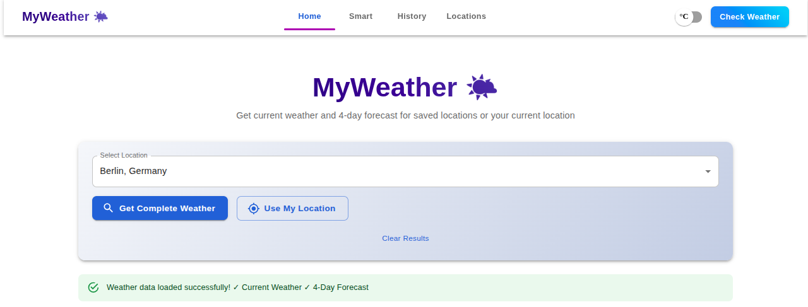
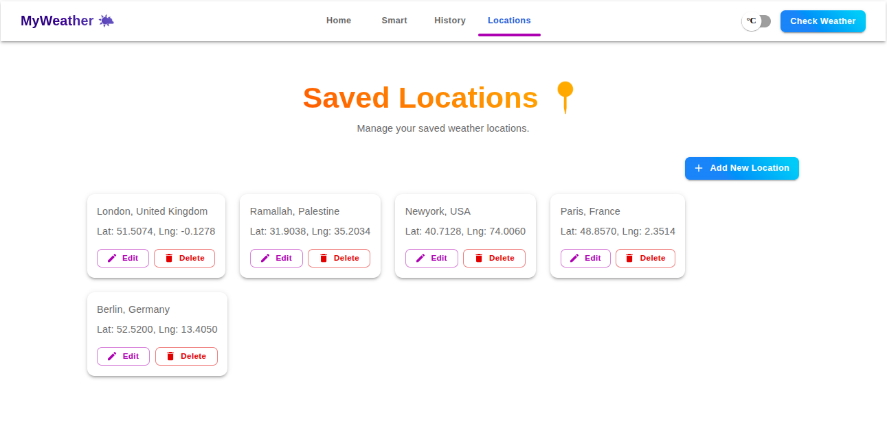
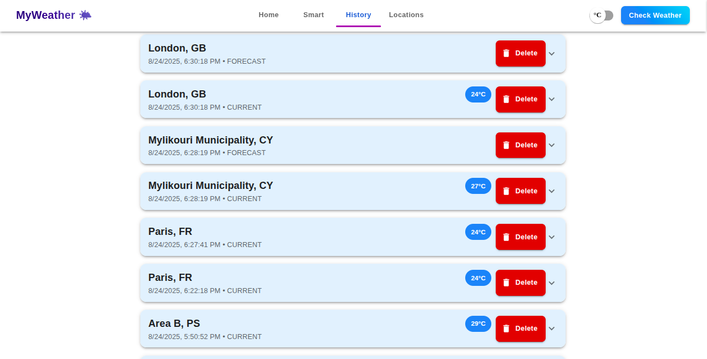
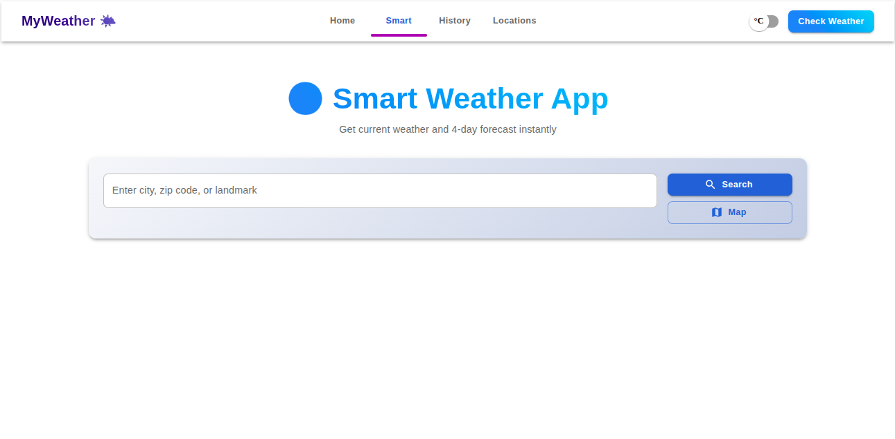
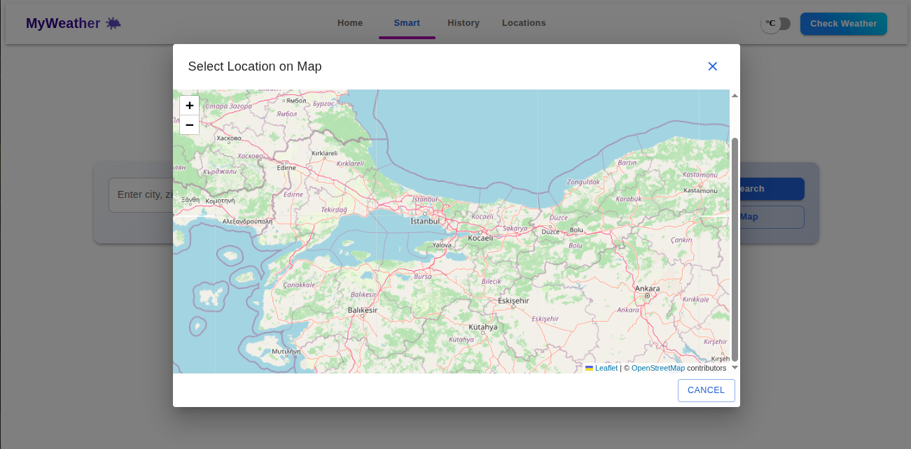
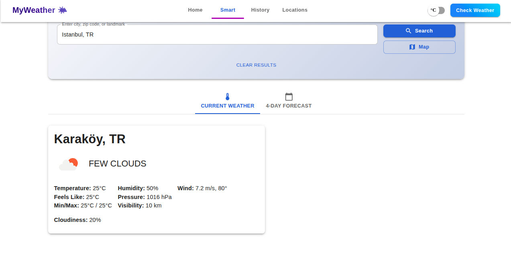
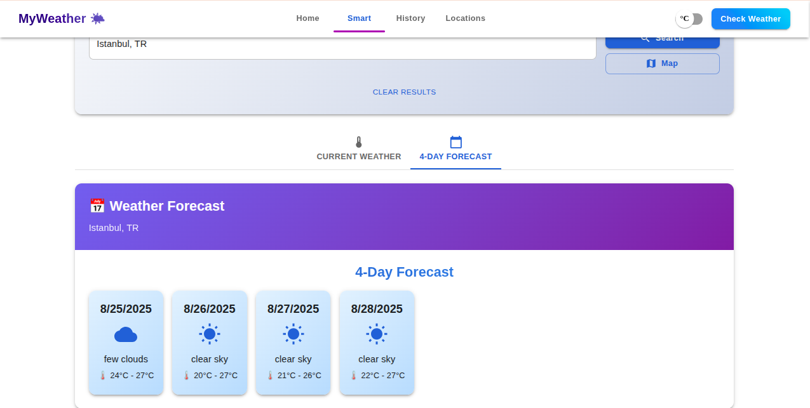

# Weather App 🌍

A modern, full-stack weather application powered by **React** (frontend) and **Node.js/Express** (backend). This app enables users to search for real-time weather data by city using the **OpenWeather API**, save and manage favorite locations in a **MongoDB** database, and interact through a sleek, responsive interface.

---

## 📑 Table of Contents

- [Project Overview](#project-overview)
- [Features](#features)
- [Technologies Used](#technologies-used)
- [Installation & Setup](#installation--setup)
- [Usage](#usage)
- [Demo](#demo)
- [Contributing](#contributing)
- [License](#license)
- [Contact](#contact)

---

## Project Overview

The Weather App delivers a seamless experience for accessing and managing weather information. Built with a modular architecture, it integrates a React-based frontend with a Node.js/Express backend, leveraging MongoDB for persistent storage and the OpenWeather API for real-time weather data. The project adheres to full-stack development best practices, ensuring secure API integration, responsive design, and scalability.

---

## ✨ Features

- **Real-Time Weather Search**: Retrieve up-to-date weather data for any city via the OpenWeather API.
- **Location Management**: Save, view, and remove favorite locations stored in MongoDB.
- **Responsive Interface**: A clean, intuitive UI built with Material-UI, optimized for desktop and mobile devices.
- **Full-Stack Integration**: Efficient communication between the React frontend and Node.js/Express backend.
- **Scalable Design**: Modular codebase to support maintenance and future enhancements.

---

## 🛠️ Technologies Used

- **Frontend**:
  - React (v18.x)
  - Material-UI (for responsive UI components)
  - Axios (for API requests)
- **Backend**:
  - Node.js (v16.x or higher)
  - Express (for API routing)
  - Mongoose (MongoDB ORM)
- **Database**: MongoDB
- **External API**: OpenWeather API
- **Tools**: Git, npm, nodemon (optional for development)

---

## ⚙️ Installation & Setup

### Prerequisites
- **Node.js**: Version 16 or higher
- **MongoDB**: Local instance or cloud-based (e.g., [MongoDB Atlas](https://www.mongodb.com/cloud/atlas))
- **OpenWeather API Key**: Sign up at [OpenWeather](https://openweathermap.org/api) to obtain a free API key
- **Git**: For cloning the repository

### 1. Clone the Repository
```bash
git clone https://github.com/mustafataha5/weather-app.git
cd weather-app
```

### 2. Backend Setup
Navigate to the server directory and install dependencies:
```bash
cd server
npm install
```

#### Configure Environment Variables
Create a `.env` file in the `server/` directory using `.env.example` as a template. Example content:
```
MONGODB_URI=mongodb+srv://<user>:<password>@<cluster>.mongodb.net/<database>?retryWrites=true&w=majority
WEATHER_API_KEY=your_openweather_api_key
PORT=5000
```
> **Security Note**: Add `.env` to `.gitignore` to prevent exposing sensitive information (e.g., API keys, database credentials).

Start the backend server:
```bash
npm start
```
> **Tip**: Use `nodemon server.js` for automatic server restarts during development.

The server will run at `http://localhost:5000`.

### 3. Frontend Setup
Navigate to the client directory and install dependencies:
```bash
cd ../client
npm install
```

Start the React application:
```bash
npm start
```
The frontend will be accessible at `http://localhost:3000`.

---

## 📖 Usage

1. Open your browser and navigate to `http://localhost:3000`.
2. Enter a city name in the search bar to fetch current weather data.
3. Save favorite locations to MongoDB for quick access.
4. Manage saved locations (view or delete) through the intuitive interface.

---

## 🎥 Demo

Explore the app’s functionality through the following screenshots, showcasing key features of the Weather App. For a full walkthrough, watch the demo video: [Watch the Demo](https://your-video-link.com).

### Screenshot Gallery
| **Home Page** | **Weather Search** | **Saved Locations** | **History** |
|---------------|--------------------|---------------------|-------------|
|  |  |  |  |

#### Additional Screenshots
- **Smart Features**:
  - 
  - 
  - 
  - 

> **Note**: Ensure the `imgs/` directory is placed in the root of the repository for the images to render correctly on GitHub.

---

## 🤝 Contributing

We welcome contributions to enhance the Weather App! To contribute:

1. Fork the repository: [github.com/mustafataha5/weather-app](https://github.com/mustafataha5/weather-app).
2. Create a feature branch:
   ```bash
   git checkout -b feature/YourFeature
   ```
3. Commit your changes:
   ```bash
   git commit -m "Add YourFeature"
   ```
4. Push to the branch:
   ```bash
   git push origin feature/YourFeature
   ```
5. Open a Pull Request on GitHub.

Please adhere to the project’s coding standards, include relevant tests, and provide clear commit messages.

---

## 📜 License

This project is licensed under the [MIT License](LICENSE). You are free to use, modify, and distribute this software in accordance with the license terms.

---

## 📬 Contact

👨‍💻 **Developed by**: [Mustafa Taha](https://www.linkedin.com/in/mustafa-taha-3b87771b4/)  
🎓 **Supported by**: [PM Accelerator](https://www.linkedin.com/school/pmaccelerator/)  

For questions, feedback, or issues:  
- Open an issue on the [GitHub repository](https://github.com/mustafataha5/weather-app).  
- Connect with the developer on [LinkedIn](https://www.linkedin.com/in/mustafa-taha-3b87771b4/).  

Thank you for exploring the Weather App! 🌦️